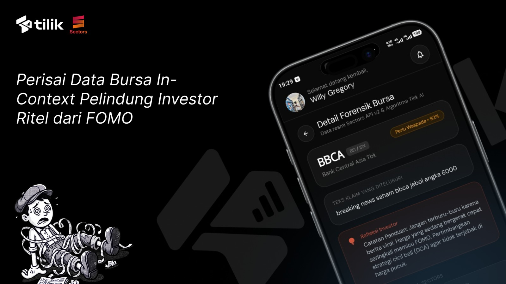

<div align="center">

<!-- =================== BANNER HERO =================== -->


<br/><br/>

<!-- =================== REPO & METRIC BADGES =================== -->
<a href="https://github.com/willgregorry/tilik-fe"></a>
<a href="https://github.com/sulthonaw/tilik-ai"></a>
<a href="https://sectors.app"></a>


<br/><br/>

<p align="center">
  <strong>Perisai data bursa in-context pelindung investor ritel dari FOMO dan klaim menyesatkan di media sosial.</strong><br/>
  Pemeriksa fakta emiten Bursa Efek Indonesia (BEI / IDX) instan berbasis Android Native floating overlay.
</p>

</div>

<br/>

<hr/>

<!-- =================== SECTION 01: OVERVIEW =================== -->
## <samp>// 01 — Overview</samp>

<table>
<tr>
<td width="65%" valign="top">

**Tilik** adalah aplikasi pendamping investasi (*financial companion*) untuk platform Android yang dirancang untuk melindungi investor ritel dari misinformasi, spekulasi sepihak, dan fenomena *pom-pom* saham di media sosial (seperti Threads, Twitter/X, dan WhatsApp).

Aplikasi ini beroperasi sebagai **floating overlay widget** (*Assistive Touch / Grammarly style*) yang melayang di atas aplikasi lain. Saat pengguna menyalin teks atau membaca klaim seputar kode emiten tertentu, Tilik mengekstraksi klaim tersebut, mencocokkannya ke **Sectors Financial API**, dan menyajikan kartu forensik data bursa dalam hitungan detik — tanpa memaksa pengguna meninggalkan aplikasi yang sedang dibuka.

Tilik mengedepankan filosofi **High-Signal & Zero-Fluff**: hanya menyajikan metrik pasar valid, status kepemilikan asing, valuasi fundamental, serta peringatan papan pemantauan khusus (FCA) tanpa basa-basi narasi buatan.

</td>
<td width="35%" valign="top">

**Project Metadata**

| Key | Value |
|---|---|
| **Platform** | Android Native (API 29+) |
| **Language** | Kotlin 2.0 |
| **UI Toolkit** | Jetpack Compose (Material 3) |
| **Architecture** | Single Activity + Foreground Service |
| **Data Engine** | Sectors Financial API |
| **AI Backend** | LangGraph + Gemini 2.5 Flash |

</td>
</tr>
</table>

<br/>

<!-- =================== SECTION 02: REPOSITORIES & ECOSYSTEM =================== -->
## <samp>// 02 — Ecosystem & Architecture</samp>

Sistem Tilik terbagi menjadi dua repositori independen yang saling terhubung melalui REST API terenkripsi:

| Repositori | Cakupan & Tanggung Jawab | Stack Teknologi | Tautan Repositori |
|---|---|---|---|
| **Tilik Android (Frontend)** | Antarmuka pengguna melayang (*floating bubble*), deteksi clipboard *real-time*, gesture physics (*snap-to-edge*, *auto-tuck*), modal bottom sheet, serta rendering data bursa. | Kotlin 2.0, Jetpack Compose, Material 3, WindowManager Native, Retrofit 2, OkHttp 3, Timber | [willgregorry/tilik-fe](https://github.com/willgregorry/tilik-fe) |
| **Tilik AI (Backend)** | *Multi-agent verification pipeline*, ekstraksi klaim bursa, integrasi Sectors API (fundamental, broker flow, top holders), kalkulasi skor keyakinan, dan perumusan vonis fakta. | Python, FastAPI, LangGraph, Sectors Financial API, Google Gemini Flash, Uvicorn | [sulthonaw/tilik-ai](https://github.com/sulthonaw/tilik-ai) |

### Alur Kerja Sistem (End-to-End Pipeline)

```text
[Media Sosial: Threads / X / WA]
                │
                ▼ (Salin Teks / Clipboard Event)
[Tilik Android: Floating Overlay & Live Clip Listener]
                │
                ▼ (POST /api/v1/verify — Multipart / JSON payload)
[Tilik AI Backend: FastAPI + LangGraph Agents]
        ┌───────┴────────────────────────┐
        ▼                                ▼
[Sectors Financial API]          [Google Gemini Agent]
- Fundamental PE / PBV           - Korelasi klaim vs data
- Arus Broker & Asing            - Skor keyakinan objektif
- Status Papan FCA               - Rekomendasi netral
        └───────┬────────────────────────┘
                │
                ▼ (Response Model: VerdictLevel, Metrics, Reason)
[Tilik Android: Verdict Bottom Sheet & Forensik Modal]
```

<br/>

<!-- =================== SECTION 03: KEY CAPABILITIES =================== -->
## <samp>// 03 — Core Capabilities</samp>

| Modul | Deskripsi Fungsional |
|---|---|
| **Floating Bubble Widget** | Widget melayang native Android menggunakan `WindowManager.LayoutParams.TYPE_APPLICATION_OVERLAY`. Dilengkapi fisika *snap-to-edge* (menempel otomatis ke tepi kiri atau kanan), *auto-tuck* mengecil dan meredup setelah 3 detik idle, serta *anti-overflow clamp* batas layar. |
| **Bidirectional Modal Sheet** | Bottom sheet interaktif dengan gestur tarik atas dan bawah: tarikan ke atas memperluas area pembacaan klaim (*expanded mode* hingga 14 baris), sedangkan tarikan ke bawah menutup sheet kembali ke bentuk bubble. |
| **Live Clipboard Synchronization** | Menggunakan `ClipboardManager.OnPrimaryClipChangedListener` yang secara instan mengenali teks baru saat disalin dari aplikasi media sosial tanpa perlu aksi manual. |
| **Analisis Forensik Sectors API** | Menampilkan rasio valuasi riil (Price-to-Earnings, Price-to-Book), konsensus pasar, arus beli/jual broker asing, serta penandaan emiten bermasalah dalam Papan Pemantauan Khusus (FCA). |
| **Zero AI-Slop Design System** | Mengadopsi palet AMOLED Black (`#0A0A0A`), kartu bertingkat squircle (`#141414`), hairline border elegan (`0x14FFFFFF`), dan navigasi bawah *frosted glass dock*. Seluruh angka dan metrik berasal langsung dari bursa. |

<br/>

<!-- =================== SECTION 04: TECH STACK =================== -->
## <samp>// 04 — Tech Stack</samp>

<details open>
<summary><strong>Android Client (Frontend)</strong></summary>
<br/>
<p>
  
  
  
  
  
  
  
  
  
  
</p>
</details>

<details open>
<summary><strong>Intelligence Backend & Data Provider</strong></summary>
<br/>
<p>
  
  
  
  
  
  
  
</p>
</details>

<br/>

<!-- =================== SECTION 05: GETTING STARTED =================== -->
## <samp>// 05 — Getting Started</samp>

### Prasyarat Pengembangan

- **Java Development Kit (JDK):** Versi 17 atau lebih baru (disarankan OpenJDK Temurin 17 / Android Studio bundled JBR).
- **Android Studio:** Ladybug / Jellyfish / Iguana atau versi yang lebih mutakhir.
- **Android SDK:** Compile SDK 35, Min SDK 29.
- **Perangkat Uji:** Smartphone fisik Android (API 29+) dengan USB Debugging aktif.

### 1. Kloning Repositori

```bash
git clone https://github.com/willgregorry/tilik-fe.git
cd tilik-fe
```

### 2. Konfigurasi Lingkungan (`.env`)

Salin berkas contoh konfigurasi lingkungan dan sesuaikan variabel yang dibutuhkan:

```bash
cp .env.example .env
```

Pastikan isi `.env` memuat alamat backend dan kredensial API yang valid:

```properties
# Base URL API Backend (sesuaikan dengan IP lokal, Dev Tunnel, atau server backend Anda)
TILIK_BASE_URL=https://6rlfv87r-8000.asse.devtunnels.ms/

# Sectors Financial API Key (https://sectors.app)
SECTORS_API_KEY=your_sectors_api_key_here

# Google Gemini API Key
GEMINI_API_KEY=your_gemini_api_key_here

# Google OAuth Web Client ID (untuk autentikasi token ID)
GOOGLE_WEB_CLIENT_ID=your_google_web_client_id_here
```

> **Catatan Keamanan:** File `.env` bersifat rahasia dan telah dikecualikan secara permanen oleh `.gitignore`. Jangan pernah meng-commit kredensial sensitif ke repositori publik.

### 3. Kompilasi & Pemasangan Aplikasi

#### Menjalankan via Gradle CLI:

```powershell
# Kompilasi paket APK Debug
.\gradlew.bat assembleDebug

# Pasang langsung ke perangkat fisik yang terhubung via ADB
.\gradlew.bat installDebug
```

#### Menjalankan via Android Studio:
1. Buka folder `tilik-fe` di Android Studio.
2. Tunggu proses *Gradle Sync* selesai mengunduh seluruh dependensi.
3. Pilih perangkat fisik target pada dropdown toolbar, lalu tekan **Run** (`Shift + F10`).

### 4. Pemberian Izin Operasional di Android

Saat aplikasi pertama kali dibuka di perangkat fisik, berikan izin sistem berikut:
1. **Tampilkan di Atas Aplikasi Lain (*Draw over other apps*):** Diperlukan untuk merender floating bubble dan modal bottom sheet.
2. **Layanan Aksesibilitas (*Accessibility Service*):** Diperlukan untuk mendeteksi konteks interaksi dan kode emiten saham di media sosial.
3. **Perekaman Layar (*Screen Capture / MediaProjection*):** Diperlukan untuk penangkapan bukti tangkapan layar saat verifikasi visual diaktifkan.

<br/>

<!-- =================== SECTION 06: STRUCTURE =================== -->
## <samp>// 06 — Directory Structure</samp>

```text
tilik-fe/
├── app/
│   ├── src/main/java/id/tilik/app/
│   │   ├── MainActivity.kt               # Entry point dashboard & navigasi bottom dock
│   │   ├── TilikApplication.kt           # Inisialisasi logging Timber & context
│   │   ├── capture/
│   │   │   └── ScreenCaptureManager.kt   # Pengelola MediaProjection & capture layar
│   │   ├── data/
│   │   │   ├── client/
│   │   │   │   └── ApiClientProvider.kt  # Retrofit & OkHttp client (auth interceptor)
│   │   │   ├── model/                    # Data transfer object (DTO) & enum vonis bursa
│   │   │   └── repository/               # Abstraksi repositori & intelligent fallback
│   │   ├── detection/
│   │   │   └── StockKeywordDetector.kt   # Regex emiten BEI & ekstraksi klaim saham
│   │   ├── service/
│   │   │   ├── OverlayService.kt         # Foreground Service sentral floating overlay
│   │   │   └── TilikAccessibilityService # Service aksesibilitas pendeteksi teks layar
│   │   └── ui/
│   │       ├── dashboard/                # Beranda (BalanceSection, Portfolio, Watchlist)
│   │       ├── history/                  # Layar riwayat forensik bursa & analitik
│   │       ├── markets/                  # Data emiten BEI & performa sektor
│   │       ├── overlay/
│   │       │   ├── FloatingBubbleView.kt # Floating bubble UI (snap, tuck, edge-tabs)
│   │       │   ├── ClaimBottomSheet.kt   # Bidirectional bottom sheet (drag gestures)
│   │       │   └── OverlayWindowManager  # Native Android WindowManager bindings
│   │       └── theme/                    # Fintech dark tokens (Theme.kt, Color.kt)
│   └── build.gradle.kts                  # Konfigurasi dependensi Compose & buildConfigField
├── banner.jpg                            # Banner dokumentasi proyek
├── DESIGN.md                             # Spesifikasi resmi Dark Investment UI System
├── PANDUAN_TESTING.md                    # Prosedur pengujian menyeluruh di HP fisik
└── README.md                             # Berkas dokumentasi utama
```

<br/>

<!-- =================== FOOTER =================== -->
<hr/>

<table width="100%">
<tr>
<td align="left">
  <sub><strong>Tilik</strong> — In-Context Stock Fact-Checker for IDX &middot; Frontend Repository</sub>
</td>
<td align="right">
  <a href="https://github.com/willgregorry/tilik-fe"></a>
  <a href="https://github.com/sulthonaw/tilik-ai"></a>
</td>
</tr>
</table>
